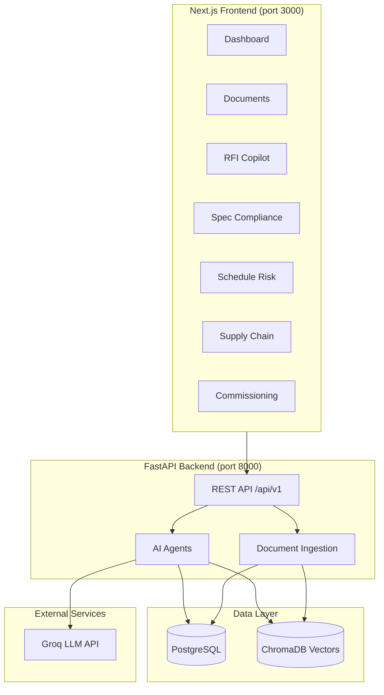

# EPC Intelligence Platform — Architecture

## Overview

The EPC Intelligence Platform is an AI-powered operational layer for hyperscale data centre construction. It connects project documents, specifications, RFIs, procurement, schedules, and commissioning into a unified intelligence system targeting Tier III/IV delivery standards.

## System architecture

## Module design

| Module | Agent | Data sources | Output |
|--------|-------|--------------|--------|
| Documents | — | PDF/Markdown uploads, `data/` corpus | Vector search, chunked embeddings |
| RFI Copilot | `rfi_agent` | ChromaDB RAG + RFI table | Cited answers, similar RFI detection |
| Spec Compliance | `spec_compliance_agent` | Specifications + submittal parse | NC records, comparison table |
| Schedule Risk | `schedule_agent` | Schedule tasks + procurement ETAs | Risk scores, Groq mitigations |
| Supply Chain | `supply_chain_agent` | Procurement items + schedule links | Shipment map, critical-path alerts |
| Commissioning | `commissioning_agent` | Commissioning tests table | Wizard progress, test records |

## Data flow

### Document ingestion (Level 1)

1. File uploaded or seeded from `data/` directory
2. PyMuPDF extracts text from PDFs; Markdown read directly
3. Text chunked (~500 tokens) with overlap
4. `sentence-transformers/all-MiniLM-L6-v2` generates local embeddings
5. Chunks stored in ChromaDB with metadata (doc_type, filename, project_id)
6. Document record stored in PostgreSQL

### RFI Copilot (Level 2)

1. User query embedded and searched against ChromaDB
2. Top-k chunks retrieved as context
3. Similar resolved RFIs found via embedding similarity on RFI table
4. Groq LLM (`llama-3.3-70b-versatile`) generates answer with citations
5. Fallback mode uses retrieved chunks directly when `GROQ_API_KEY` unset
6. Audit event logged for hours-saved tracking

### Spec Compliance (Level 3)

1. Submittal uploaded (Markdown/PDF)
2. Attributes extracted via regex rules (+ optional Groq JSON extraction)
3. Each specification requirement compared rule-based
4. Failures create `NonConformance` records with severity
5. Golden test suite validates 4 planted deviations in `data/submittals/`

### Schedule Risk (Level 4)

1. Schedule tasks linked to procurement items via `depends_on_procurement_id`
2. Risk score computed: procurement ETA vs planned start date
3. High-risk tasks (score ≥ 0.5) surfaced on dashboard
4. Mitigation options generated via Groq or rule-based fallback

### Supply Chain (Level 4)

1. Procurement items seeded with origin/current/destination coordinates
2. At-risk and delayed shipments generate alerts
3. Alerts linked to critical-path schedule tasks for impact visibility

### Commissioning (Level 5)

1. Tests seeded from TIA-942 / Uptime Tier procedures
2. Wizard guides witness through pass/fail/NC recording
3. Progress tracked by system type (power, cooling)

## Database schema

Core entities in PostgreSQL:

- `projects` — project metadata (tier, location, status)
- `documents` — ingested file records with parsed text
- `specifications` — structured requirement rules
- `submittals` / `non_conformances` — compliance workflow
- `rfis` — request for information records
- `procurement_items` — equipment shipments with geo coordinates
- `schedule_tasks` — planned tasks with procurement dependencies
- `commissioning_tests` — IST procedures and results
- `audit_events` — action log for hours-saved metrics

## Tech stack rationale

| Choice | Reason |
|--------|--------|
| Next.js + Tailwind | Fast UI development, industrial dark theme |
| FastAPI | Async-ready, auto OpenAPI docs, Python ML ecosystem |
| PostgreSQL | Relational integrity for EPC workflow entities |
| ChromaDB | Local vector store, no cloud dependency for demo |
| sentence-transformers | Free local embeddings, no API cost |
| Groq | Free-tier fast LLM for RAG and mitigations |
| Docker Postgres | Isolated DB on port 5433 (avoids Windows Postgres conflict) |

## Security notes

- `GROQ_API_KEY` stored in `backend/.env` (not committed)
- CORS restricted to configured origins
- No authentication in demo mode — add OAuth/JWT for production

## Deployment

For production:

1. Replace SQLite fallback with managed PostgreSQL
2. Persist ChromaDB to volume or migrate to Pinecone/pgvector
3. Add authentication and project-level access control
4. Containerize with Docker Compose (frontend + backend + db)
5. Set `GROQ_API_KEY` via secrets manager
